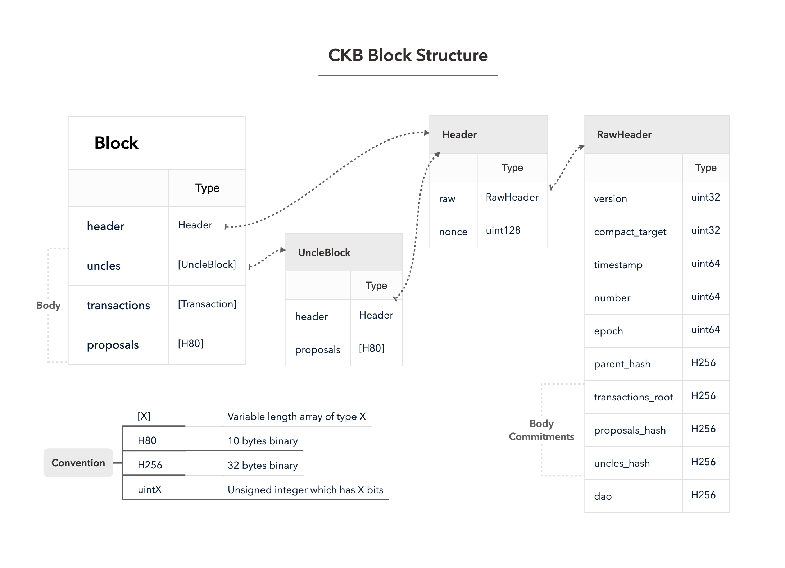
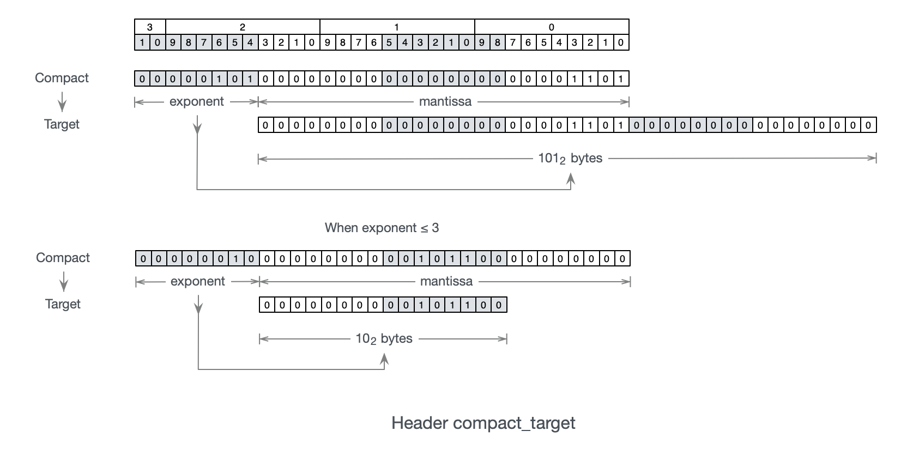
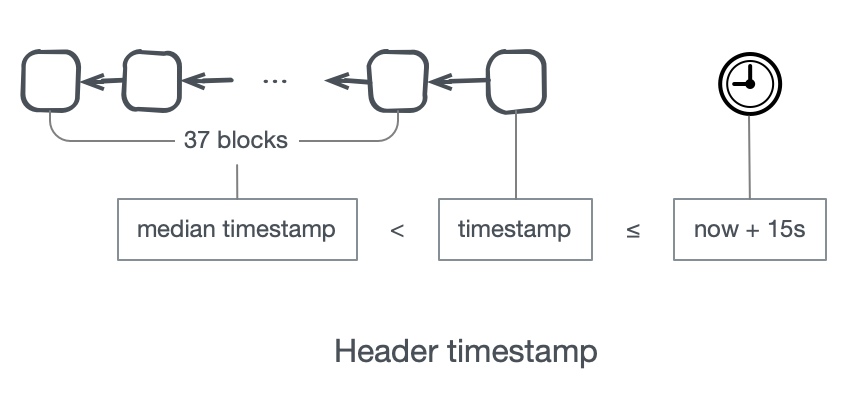
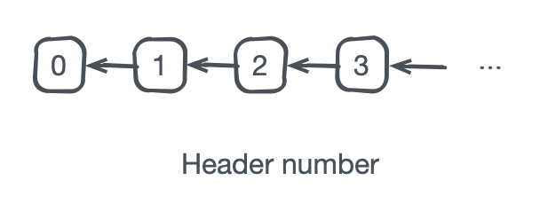
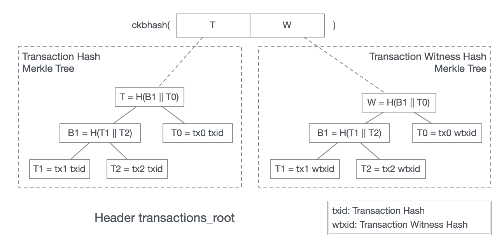
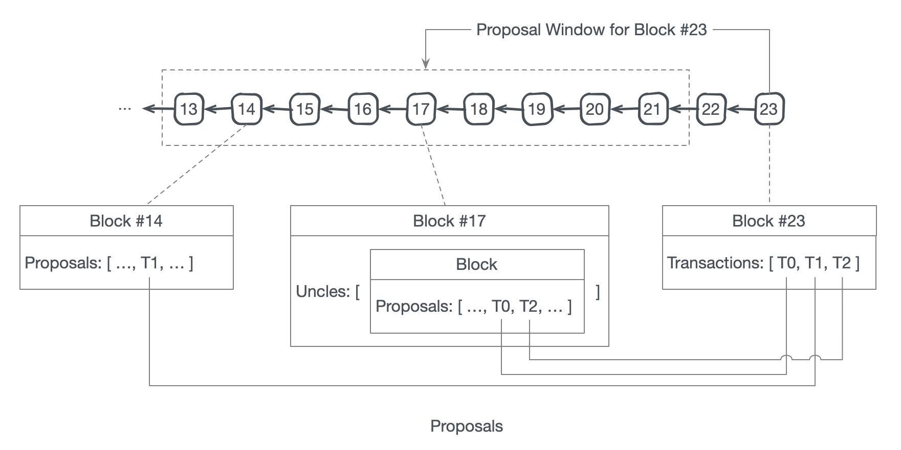

# CKB Block Structure

In CKB, Block is a container of transactions. It carries the information required by consensus so the participants can verify and recognize the canonical chain.

The snippet below lists the molecule schema definitions related to block. The following paragraphs will explain these structures field by field.

```
array ProposalShortId [byte; 10];

vector UncleBlockVec <UncleBlock>;
vector TransactionVec <Transaction>;
vector ProposalShortIdVec <ProposalShortId>;

table Block {
    header:                 Header,
    uncles:                 UncleBlockVec,
    transactions:           TransactionVec,
    proposals:              ProposalShortIdVec,
}

struct Header {
    raw:                    RawHeader,
    nonce:                  Uint128,
}

struct RawHeader {
    version:                Uint32,
    compact_target:         Uint32,
    timestamp:              Uint64,
    number:                 Uint64,
    epoch:                  Uint64,
    parent_hash:            Byte32,
    transactions_root:      Byte32,
    proposals_hash:         Byte32,
    uncles_hash:            Byte32,
    dao:                    Byte32,
}

table UncleBlock {
    header:                 Header,
    proposals:              ProposalShortIdVec,
}
```


※ [blockchain.mol in ckb v0.34.1](https://github.com/nervosnetwork/ckb/blob/v0.34.1/util/types/schemas/blockchain.mol)



## Block

A Block can be split into two parts, header, and body. The field `header` is the header part. The remaining fields, `uncles`, `transactions`, and `proposals` are the body part.

```
table Block {
    header:                 Header,
    uncles:                 UncleBlockVec,
    transactions:           TransactionVec,
    proposals:              ProposalShortIdVec,
}
```

The header contains commitments on the body fields to ensure data integrity. CKB client can download and verify the header first, then download the much larger body part. Since PoW verification only requires header and uncles count in an epoch, this design can avoid wasting the bandwidth to download garbage data.

## Header

To ease PoW computation, the header is split into `raw` and `nonce`. 

```
struct Header {
    raw:                    RawHeader,
    nonce:                  Uint128,
}
```

The header must meet the last inequality in the following snippet:

```
pow_hash := ckbhash(molecule_serialize(raw))
pow_message := pow_hash || to_le(nounce)
pow_output := eaglesong(pow_message)
// for testnet, there is another round of hash
// pow_output = ckbhash(pow_output)

from_be(pow_output) <= compact_to_target(raw.compact_target)
```

※ [eaglesong in ckb v0.34.1](https://github.com/nervosnetwork/ckb/blob/v0.34.1/pow/src/eaglesong.rs)

Functions used in the pseudocode:

* `:=`: assignment
* `||`: binary concatenation.
* `ckbhash`: Blake2b hash with CKB specific configuration, see Appendix.
* `to_le`: Convert unsigned integer to bytes in little-endian. The bytes count is the same with the integer width.
* `from_be`: Convert bytes encoded in big-endian to an unsigned integer.
* `molecule_serialize`: Serialize a structure into binary using its schema.
* `eaglesong`: See RFC [Eaglesong (Proof-of-Work Function for Nervos CKB)](https://github.com/nervosnetwork/rfcs/blob/master/rfcs/0010-eaglesong/0010-eaglesong.md).
* `compact_to_target`: `raw.compact_target` encodes the difficulty target in a compact form. This function restores the target from the compact form.

The block is referenced by the header hash, for example, in `raw.parent_hash`.

```
header_hash := ckb_hash(molecule_serialize(header))
```

※ [HeaderReader::calc_header_hash in util/types/src/extension/calc_hash.rs](https://github.com/nervosnetwork/ckb/blob/v0.34.1/util/types/src/extension/calc_hash.rs#L103)

Notice that Header and RawHeader are all fixed-size structures. The serialization of them is just the simple binary concatenation of the fields in order.

## RawHeader

RawHeader is the payload of the block header.

### `version (Uint32)`

It must equal to 0 now and is reserved for future upgrades.

### `compact_target (Uint32)`

The header `compact_target` is the encoded form of the target threshold as it appears in the block header.

It is similar to `nBits` in bitcoin, the original `nBits` implementation inherits properties from a signed data class, allowing the target threshold to be negative if the high bit of the significant is set. This is useless—the header hash is treated as an unsigned number, so it can never be equal to or lower than a negative target threshold.

In CKB, the "compact" format is a representation of a whole number N using an unsigned 32bit number similar to a floating-point format. 

* The most significant 8 bits are the unsigned exponent of base 256.
* This exponent can be thought of as "number of bytes of N" in which the first 3 bytes are the mantissa. 
* The lower 24 bits are the mantissa. 

```
N = mantissa * 256^(exponent-3)
```



Python 3 Example and test vectors:

``` python
import unittest

def compact_to_target(compact):
    exponent = compact >> 24
    mantissa = compact & 0x00ffffff
    rtn = 0
    if (exponent <= 3):
        mantissa >>= (8 * (3 - exponent))
        rtn = mantissa
    else:
        rtn = mantissa
        rtn <<= (8 * (exponent - 3))
    overflow = mantissa != 0 and (exponent > 32)
    return rtn, overflow


def target_to_compact(target):
    bits = (target).bit_length()
    exponent = ((bits + 7) // 8)
    compact = target << (
        8 * (3 - exponent)) if exponent <= 3 else (target >> (8 * (exponent - 3)))
    compact = (compact | (exponent << 24))
    return compact


class TestCompactTarget(unittest.TestCase):

    def test_compact_target1(self):
        compact = target_to_compact(0x2)
        self.assertEqual('0x1020000', hex(compact))
        target, overflow = compact_to_target(0x1020000)
        self.assertTupleEqual((2, False), (target, overflow))

    def test_compact_target2(self):
        compact = target_to_compact(0xfe)
        self.assertEqual('0x1fe0000', hex(compact))
        target, overflow = compact_to_target(0x1fedcba)
        self.assertTupleEqual((0xfe, False), (target, overflow))


if __name__ == '__main__':
    unittest.main()
```

See details in the source code [difficulty.rs](https://github.com/nervosnetwork/ckb/blob/develop/util/types/src/utilities/difficulty.rs).

The `compact_target` does not change in an epoch. In a new epoch, the difficulty is adjusted according to all the headers and the total uncles count in the previous epoch. See [Dynamic Difficulty Adjustment Mechanism](https://github.com/nervosnetwork/rfcs/blob/master/rfcs/0020-ckb-consensus-protocol/0020-ckb-consensus-protocol.md#Dynamic-Difficulty-Adjustment-Mechanism) in the consensus protocol RFC.

The genesis block `compact_target` is hardcoded in the consensus specification.

### `timestamp (Uint64)`

The time when the block is created encoded as Unix Timestamp, in milliseconds. For example

```
1588233578000 is Thu, 30 Apr 2020 07:59:38 +0000
```

There's a consensus rule to verify that the block timestamp must be larger than the median timestamp of the previous 37 blocks.

The Nervos Network CKB client rejects blocks in which timestamp is more than 15 seconds in the future, however, this is not a consensus rule.



The genesis block `timestamp` is hardcoded in the consensus specification.

### `number (Uint64)`

A sequential number which encodes the genesis block as 0 and the child block number is the parent block number plus 1.



```
genesis_header.number := 0
header.number := parent_header.number + 1
```

### `epoch (Uint64)`

This field encodes the epoch number and the fraction position of this block in the epoch.

The lower 56 bits of the epoch field are split into 3 parts (listed in the order from higher bits to lower bits):

* The highest 16 bits represent the epoch length
* The next 16 bits represent the current block index in the epoch, starting from 0.
* The lowest 24 bits represent the current epoch number.


Assume there's a block, which number is 11555 and in epoch 50. The epoch 50 starts from block 11000 and have 1000 blocks. The epoch field for this particular block will then be 9326559282, which is calculated in the following way:

```
50 | ((11555 - 11000) << 24) | (1000 << 16)
```

The genesis epoch number is 0 and the genesis block relative index in the epoch is also 0. So the genesis block epoch field only depends on the genesis epoch length, which is hardcoded in the consensus specification.

### `parent_hash (Byte32)`

The header hash of the parent block. The genesis block `parent_hash` is hardcoded in the consensus specification.

### `transaction_root (Byte32)`

This is the commitment to all the transactions in the block.

It is a hash on two Merkle Tree roots

```
ckbhash(T || W)
```

The function `ckbhash` is the default digest algorithm in CKB, see Appendix.

`T` is the root of a CKB Merkle Tree, which items are the transaction hashes of all the transactions in the block.

`W` is also the root of a CKB Merkle Tree, but the items are the transaction witness hashes of all the transactions in the block.



See Appendix for the references of CKB Merkle Tree and two different transaction hashes.

### `proposals_hash (Byte32)`

Field `proposals_hash` is the hash on `proposals` in the block body.

It is all zeros when `proposals` is empty, or `ckbhash` on all the bytes concatenated together.

```
proposals_hash = 0 when proposals are empty, otherwise

proposals_hash = ckb_hash(P1 || P2 || ... || Pn)
  where Pi is the i-th ProposalShortId in proposals
```

### `uncles_hash (Byte32)`

Field `uncles_hash` is the hash on `uncles` in the block body.

It is all zeros when `uncles` is empty, or `ckbhash` on all the uncle header hashes concatenated together.

```
uncles_hash = 0 when uncles is empty, otherwise

uncles_hash = ckb_hash(U1 || U2 || ... || Un)
  where Ui is the header_hash of the i-th uncle in uncles
```

Recall that header hash is the hash of the whole serialized header.

```
header_hash := ckb_hash(molecule_serialize(header))
```

### `dao (Byte32)`

The dao field compacts 4 64-bits unsigned integers in little-endian.

* `C_i`, bytes 0 to 7
* `AR_i`, bytes 8 to 15
* `S_i`, bytes 16 to 23
* `U_i`, bytes 24 to 31

See RFC [Deposit and Withdraw in Nervos DAO](https://github.com/nervosnetwork/rfcs/blob/master/rfcs/0023-dao-deposit-withdraw/0023-dao-deposit-withdraw.md#calculation).

## Transactions

The field `block.transactions` is the ordered list of transactions in the block. The first transaction must be the cellbase. See the transaction informational RFC.

## Uncles

The field `block.uncles` is the ordered list of uncle blocks.

A block B1 is considered to be the uncle of another block B2 if all the following conditions are met:

1. They are in the same epoch, sharing the same difficulty;
2. B2 block number is larger than B1;
3. B1's parent is either B2's ancestor or an uncle embedded in B2 or any of B2's ancestors.
4. B2 is the first block in its chain to refer to B1.

The chain stores only the uncle block header and proposal IDs. The header ensures the block is covered by PoW and can pass the consensus rules on uncle blocks. Proposal IDs are there because a block can commit transactions proposed in an uncle.

## Proposals

Transaction proposal ID is the first 10 bytes of the Transaction Hash.

Unlike Bitcoin, CKB requires to propose the transaction proposal IDs before committing the transaction into the chain.

A transaction is said proposed in block B if its proposal ID appears in B's or B's uncles' `proposals` field. A transaction is commit if it is included in the block `transactions` field.

Two protocol parameters *close* and *far* define the closest and farthest on-chain distance between a transaction's proposal and commitment.

A non-cellbase transaction commit in block which number is *c* must have been proposed in block with number *p*, where

```
close <= c - p <= far
```

In CKB Lina the mainnet, *close* is 2 and *far* is 10. Thus

```
2 <= c - p <= 10
```



## Appendix

### Molecule

Molecule is a serialization framework.

- [Specification](https://github.com/nervosnetwork/rfcs/blob/master/rfcs/0008-serialization/0008-serialization.md)
- [Rust/C Code Generator](https://github.com/nervosnetwork/molecule)

The molecule schema used in CKB can be found in [util/types/schemas](https://github.com/nervosnetwork/ckb/tree/develop/util/types/schemas)

### ckbhash

CKB uses [blake2b](https://blake2.net/blake2.pdf) as the default hash algorithm with following configurations:

- output digest size: 32
- personalization: ckb-default-hash

Python 3 Example and test vectors:

```python
import hashlib
import unittest

def ckbhash():
    return hashlib.blake2b(digest_size=32, person=b'ckb-default-hash')

class TestCKBBlake2b(unittest.TestCase):

    def test_empty_message(self):
        hasher = ckbhash()
        hasher.update(b'')
        self.assertEqual('44f4c69744d5f8c55d642062949dcae49bc4e7ef43d388c5a12f42b5633d163e', hasher.hexdigest())

if __name__ == '__main__':
    unittest.main()
```

## CKB Merkle Tree 

CKB Merkle Tree is a [CBMT](https://github.com/nervosnetwork/rfcs/blob/master/rfcs/0006-merkle-tree/0006-merkle-tree.md) using following merge function:

```
ckbhash(left || right)
```

* ckbhash is the hash function.
* `||` denotes binary concatenation.

## Transaction Hash

The transaction is serialized via Molecule in CKB. Its schema is:

```
table Transaction {
    raw:            RawTransaction,
    witnesses:      BytesVec,
}
```

The transaction hash is the `ckbhash` on the serialized `raw`.

## Transaction Witness Hash

The transaction is serialized via Molecule in CKB.

The transaction witness hash is the `ckbhash` on the whole serialized transaction.
